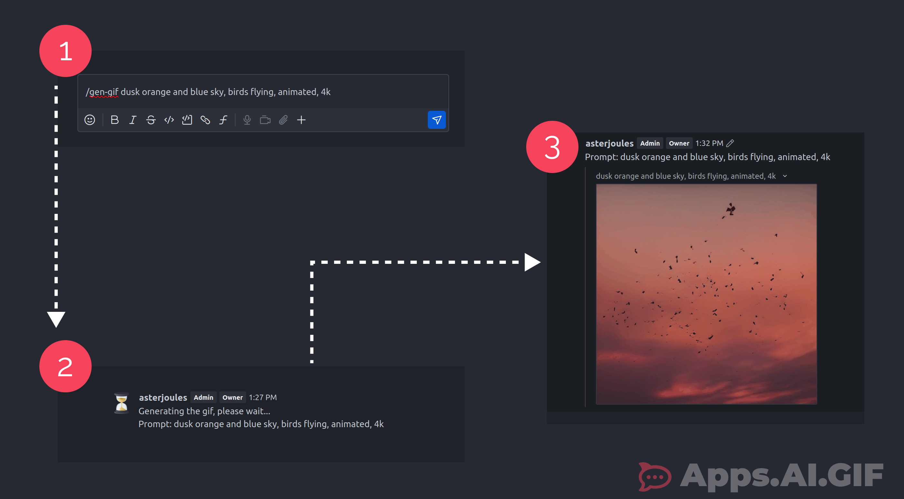

# Apps.AI.GIF



A Rocket.Chat App that allows users to generate GIFs directly within the chat interface using descriptive prompts. 

> [GSOC'24 Project Link](https://summerofcode.withgoogle.com/programs/2024/projects/41d12z0y)

## Features

- [ ] **GIF Generation**: Generate GIFs directly by providing a descriptive prompt.
- [ ] **Storage Solutions**: Store generated GIFs within the RC Channel using local storage APIs provided by RC.
- [ ] **Customizable Options**: Offer a variety of settings like width, height, WebHook URL, negative prompts, etc.
- [ ] **History Preview**: Display users' previous GIF generations in a horizontal preview menu.
- [ ] **Prompt Suggestions**: Provide a list of different prompts generated by the NLP for users to choose from.
- [ ] **NLP-Enhanced Prompts**: Utilize NLP capabilities to enhance prompts and produce better GIFs.
- [ ] **NSFW Content Filtering**: Identify and deny any NSFW GIF generation requests.
- [ ] **Negative Prompts**: Use negative prompts to improve output quality, configurable in the preferences.
- [ ] **Searchable History**: Implement a search drawer to search through previous generations based on prompts.
- [ ] **Regeneration Feature**: Allow users to regenerate a GIF if the previous result is unsatisfactory.


## Getting Started

```bash
  npm install -g @rocket.chat/apps-cli
  npm i
  rc-apps deploy --url <url> --username <username> --password <password>

```


## Documentation
Here are some links to examples and documentation:
- [Rocket.Chat Apps TypeScript Definitions Documentation](https://rocketchat.github.io/Rocket.Chat.Apps-engine/)
- [Rocket.Chat Apps TypeScript Definitions Repository](https://github.com/RocketChat/Rocket.Chat.Apps-engine)
- [Demo App](https://github.com/RocketChat/Rocket.Chat.Demo.App)
- [Notion App](https://github.com/RocketChat/Apps.Notion)
- [Example Rocket.Chat Apps](https://github.com/graywolf336/RocketChatApps)
- Community Forums
  - [App Requests](https://forums.rocket.chat/c/rocket-chat-apps/requests)
  - [App Guides](https://forums.rocket.chat/c/rocket-chat-apps/guides)
  - [Top View of Both Categories](https://forums.rocket.chat/c/rocket-chat-apps)
- [#rocketchat-apps on Open.Rocket.Chat](https://open.rocket.chat/channel/rocketchat-apps)
