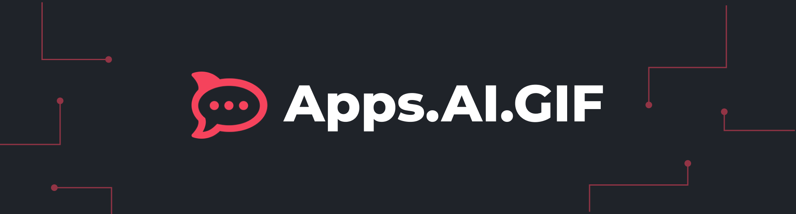
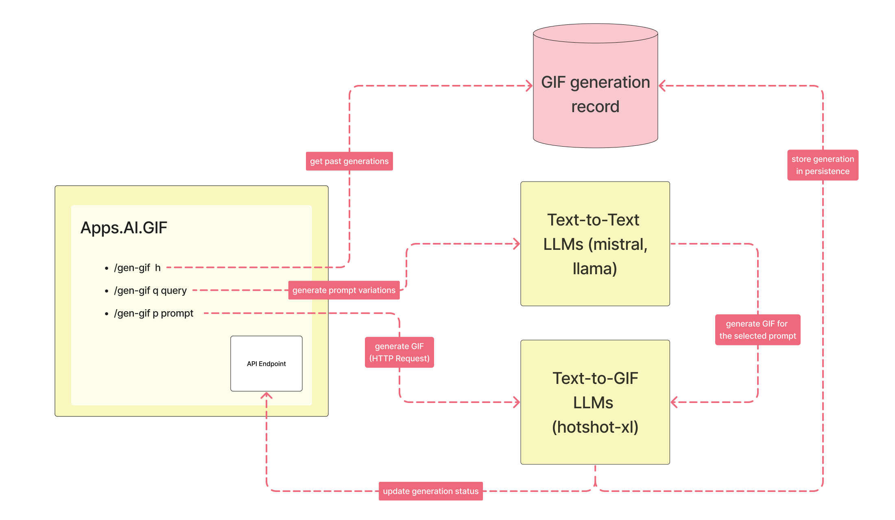

<div align="center">
    <p>A Rocket.Chat App that allows users to generate GIFs directly within the chat interface using descriptive prompts.</p>
    <a href="https://summerofcode.withgoogle.com/programs/2024/projects/41d12z0y">GSoC'24 Project Link</a>
</div>

## Features

- [x] **GIF Generation**: Generate GIFs directly by providing a descriptive prompt.
- [x] **Customizable Options**: Offer a variety of settings like width, height, WebHook URL, negative prompts, etc.
- [x] **History Preview**: Display users' previous GIF generations in a horizontal preview menu.
- [x] **Prompt Suggestions**: Provide a list of different prompts generated by the NLP for users to choose from.
- [x] **NLP-Enhanced Prompts**: Utilize NLP capabilities to enhance prompts and produce better GIFs.
- [x] **NSFW Content Filtering**: Identify and deny any NSFW GIF generation requests.
- [x] **Regeneration Feature**: Allow users to regenerate a GIF if the previous result is unsatisfactory.
- [x] **A help command**: A command that allows users to view how to use this app.
- [x] **Pagination in history**: Allow storing more than 10 generations and a way to view past generations.
- [x] **Storage Solutions**: Store generated GIFs within the RC Channel using local storage APIs provided by RC.
- [ ] **Negative Prompts**: Use negative prompts to improve output quality, configurable in the preferences.
- [ ] **Searchable History**: Implement a search drawer to search through previous generations based on prompts.

## Usage

```
• use `gen-gif q "<yourqueryhere>" to get a few prompt variations based on query and then request for GIF generation selecting one of the suggested prompts.
• use `gen-gif p "<yourprompthere>" to directly use your prompt for GIF generation.
• use `gen-gif history` to view past generations.
```

## Installation Guide

Firstly, ensure you have a Rocket.Chat Server running either locally or you have the URL of a remote running server.

1. Clone the repository to your local system:
    ```cmd
    git clone https://github.com/<yourusername>/apps.ai.gif
    ```
2. Install all dependencies:
   ```cmd
   npm i
   ```
3. Deploy the app to your server:
   ```cmd
   rc-apps deploy --url <url> --username <username> --password <password>
   ```
4. Once deployed, we need to set the prefences to use all the features. Go to installed apps -> private apps and under settings provide the following settings:
   
   > a. apiKey: Replicate API Key, generate one from [here](https://replicate.com/).
   
   > b. webhookUrl: Can be easily found under the details panel, under the API heading. Copy the URL part and paste in this field. 
   

## Architecture




## Documentation
Here are some links to examples and documentation:
- [Rocket.Chat Apps TypeScript Definitions Documentation](https://rocketchat.github.io/Rocket.Chat.Apps-engine/)
- [Rocket.Chat Apps TypeScript Definitions Repository](https://github.com/RocketChat/Rocket.Chat.Apps-engine)
- [Demo App](https://github.com/RocketChat/Rocket.Chat.Demo.App)
- [Notion App](https://github.com/RocketChat/Apps.Notion)
- [Example Rocket.Chat Apps](https://github.com/graywolf336/RocketChatApps)
- Community Forums
  - [App Requests](https://forums.rocket.chat/c/rocket-chat-apps/requests)
  - [App Guides](https://forums.rocket.chat/c/rocket-chat-apps/guides)
  - [Top View of Both Categories](https://forums.rocket.chat/c/rocket-chat-apps)
- [#rocketchat-apps on Open.Rocket.Chat](https://open.rocket.chat/channel/rocketchat-apps)